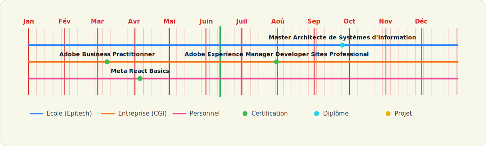
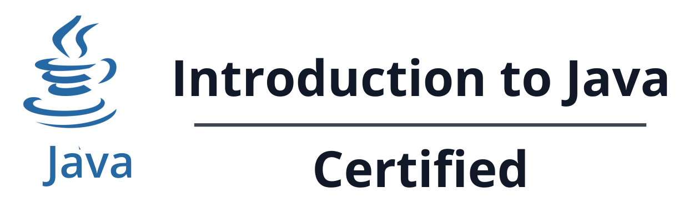

  <picture>
    <source media="(prefers-color-scheme: dark)" srcset="./images/github-banner-dark.svg">
    <source media="(prefers-color-scheme: light)" srcset="./images/github-banner-light.svg">
    
  </picture>

 

 
  
  

<h2 align="center">Actuellement</h2>

* Développeur web en alternance chez CGI, où je contribue à des projets applicatifs orientés besoins métier et expérience utilisateur
* Étudiant en mastère **Architecte de Systèmes d’Information** à **Epitech**
* J’approfondis actuellement les écosystèmes **Java/JVM**, **Node.js/TypeScript** et **AEM**
* Stack principale : **React**, **Express**, **PostgreSQL**, avec une attention particulière au tooling et à l’industrialisation

  <h2>Feuille de route</h2>
  <picture>
    <source media="(prefers-color-scheme: dark)" srcset="./timeline-dark.svg">
    <source media="(prefers-color-scheme: light)" srcset="./timeline-light.svg">
    
  </picture>

<h2 align="center">Certifications</h2>

  

    <strong>
      
      Certification Java
    </strong>
  

   

  

    <a href="https://scrimalianthony.github.io/Certifications/Java/Hyperskill%20Certificate%208-4d95a2ac.pdf">
      <picture>
        <source media="(prefers-color-scheme: dark)" srcset="./images/java-introduction-banner-dark.svg">
        <source media="(prefers-color-scheme: light)" srcset="./images/java-introduction-banner-light.svg">
        
      </picture>
    </a>

   
    Cliquez sur la bannière pour voir le certificat

  

   

  

    <a href="https://github.com/ScrimaliAnthony/Battleship-Java">
      <picture>
        <source media="(prefers-color-scheme: dark)" srcset="https://github-readme-stats-snowy-one-45.vercel.app/api/pin/?username=ScrimaliAnthony&amp;repo=Battleship-Java&amp;title_color=58A6FF&amp;text_color=C9D1D9&amp;icon_color=8B949E&amp;bg_color=0D1117&amp;border_color=30363D">
        <source media="(prefers-color-scheme: light)" srcset="https://github-readme-stats-snowy-one-45.vercel.app/api/pin/?username=ScrimaliAnthony&amp;repo=Battleship-Java&amp;title_color=0969DA&amp;text_color=57606A&amp;icon_color=57606A&amp;bg_color=FFFFFF&amp;border_color=D0D7DE">
        
      </picture>
    </a>
    <a href="https://github.com/ScrimaliAnthony/BullsAndCows-Java">
      <picture>
        <source media="(prefers-color-scheme: dark)" srcset="https://github-readme-stats-snowy-one-45.vercel.app/api/pin/?username=ScrimaliAnthony&amp;repo=BullsAndCows-Java&amp;title_color=58A6FF&amp;text_color=C9D1D9&amp;icon_color=8B949E&amp;bg_color=0D1117&amp;border_color=30363D">
        <source media="(prefers-color-scheme: light)" srcset="https://github-readme-stats-snowy-one-45.vercel.app/api/pin/?username=ScrimaliAnthony&amp;repo=BullsAndCows-Java&amp;title_color=0969DA&amp;text_color=57606A&amp;icon_color=57606A&amp;bg_color=FFFFFF&amp;border_color=D0D7DE">
        
      </picture>
    </a>
    <a href="https://github.com/ScrimaliAnthony/CoffeeMachineSimulator-Java">
      <picture>
        <source media="(prefers-color-scheme: dark)" srcset="https://github-readme-stats-snowy-one-45.vercel.app/api/pin/?username=ScrimaliAnthony&amp;repo=CoffeeMachineSimulator-Java&amp;title_color=58A6FF&amp;text_color=C9D1D9&amp;icon_color=8B949E&amp;bg_color=0D1117&amp;border_color=30363D">
        <source media="(prefers-color-scheme: light)" srcset="https://github-readme-stats-snowy-one-45.vercel.app/api/pin/?username=ScrimaliAnthony&amp;repo=CoffeeMachineSimulator-Java&amp;title_color=0969DA&amp;text_color=57606A&amp;icon_color=57606A&amp;bg_color=FFFFFF&amp;border_color=D0D7DE">
        
      </picture>
    </a>
    <a href="https://github.com/ScrimaliAnthony/LastPencils-Java">
      <picture>
        <source media="(prefers-color-scheme: dark)" srcset="https://github-readme-stats-snowy-one-45.vercel.app/api/pin/?username=ScrimaliAnthony&amp;repo=LastPencils-Java&amp;title_color=58A6FF&amp;text_color=C9D1D9&amp;icon_color=8B949E&amp;bg_color=0D1117&amp;border_color=30363D">
        <source media="(prefers-color-scheme: light)" srcset="https://github-readme-stats-snowy-one-45.vercel.app/api/pin/?username=ScrimaliAnthony&amp;repo=LastPencils-Java&amp;title_color=0969DA&amp;text_color=57606A&amp;icon_color=57606A&amp;bg_color=FFFFFF&amp;border_color=D0D7DE">
        
      </picture>
    </a>
    <a href="https://github.com/ScrimaliAnthony/CinemaRoomManager-Java">
      <picture>
        <source media="(prefers-color-scheme: dark)" srcset="https://github-readme-stats-snowy-one-45.vercel.app/api/pin/?username=ScrimaliAnthony&amp;repo=CinemaRoomManager-Java&amp;title_color=58A6FF&amp;text_color=C9D1D9&amp;icon_color=8B949E&amp;bg_color=0D1117&amp;border_color=30363D">
        <source media="(prefers-color-scheme: light)" srcset="https://github-readme-stats-snowy-one-45.vercel.app/api/pin/?username=ScrimaliAnthony&amp;repo=CinemaRoomManager-Java&amp;title_color=0969DA&amp;text_color=57606A&amp;icon_color=57606A&amp;bg_color=FFFFFF&amp;border_color=D0D7DE">
        
      </picture>
    </a>
    <a href="https://github.com/ScrimaliAnthony/TicTacToe-Java">
      <picture>
        <source media="(prefers-color-scheme: dark)" srcset="https://github-readme-stats-snowy-one-45.vercel.app/api/pin/?username=ScrimaliAnthony&amp;repo=TicTacToe-Java&amp;title_color=58A6FF&amp;text_color=C9D1D9&amp;icon_color=8B949E&amp;bg_color=0D1117&amp;border_color=30363D">
        <source media="(prefers-color-scheme: light)" srcset="https://github-readme-stats-snowy-one-45.vercel.app/api/pin/?username=ScrimaliAnthony&amp;repo=TicTacToe-Java&amp;title_color=0969DA&amp;text_color=57606A&amp;icon_color=57606A&amp;bg_color=FFFFFF&amp;border_color=D0D7DE">
        
      </picture>
    </a>
  

  

    <strong>
      
      Harvard CS50x
    </strong>
  

   

  

    <a href="https://scrimalianthony.github.io/Certifications/CS50x/CS50x.png">
      <picture>
        <source media="(prefers-color-scheme: dark)" srcset="./images/harvard-cs50x-banner-dark.svg">
        <source media="(prefers-color-scheme: light)" srcset="./images/harvard-cs50x-banner-light.svg">
        
      </picture>
    </a>

   
    Cliquez sur la bannière pour voir le certificat

  

   

  <a href="https://github.com/ScrimaliAnthony/PomodoroWeb">
    <picture>
      <source media="(prefers-color-scheme: dark)" srcset="https://github-readme-stats-snowy-one-45.vercel.app/api/pin/?username=ScrimaliAnthony&amp;repo=PomodoroWeb&amp;v=2&amp;title_color=58A6FF&amp;text_color=C9D1D9&amp;icon_color=8B949E&amp;bg_color=0D1117&amp;border_color=30363D">
      <source media="(prefers-color-scheme: light)" srcset="https://github-readme-stats-snowy-one-45.vercel.app/api/pin/?username=ScrimaliAnthony&amp;repo=PomodoroWeb&amp;v=2&amp;title_color=0969DA&amp;text_color=57606A&amp;icon_color=57606A&amp;bg_color=FFFFFF&amp;border_color=D0D7DE">
      
    </picture>
  </a>
  <a href="https://github.com/ScrimaliAnthony/CS50x-9_Flask">
    <picture>
      <source media="(prefers-color-scheme: dark)" srcset="https://github-readme-stats-snowy-one-45.vercel.app/api/pin/?username=ScrimaliAnthony&amp;repo=CS50x-9_Flask&amp;v=2&amp;title_color=58A6FF&amp;text_color=C9D1D9&amp;icon_color=8B949E&amp;bg_color=0D1117&amp;border_color=30363D">
      <source media="(prefers-color-scheme: light)" srcset="https://github-readme-stats-snowy-one-45.vercel.app/api/pin/?username=ScrimaliAnthony&amp;repo=CS50x-9_Flask&amp;v=2&amp;title_color=0969DA&amp;text_color=57606A&amp;icon_color=57606A&amp;bg_color=FFFFFF&amp;border_color=D0D7DE">
      
    </picture>
  </a>
  <a href="https://github.com/ScrimaliAnthony/CS50x-8_Frontend">
    <picture>
      <source media="(prefers-color-scheme: dark)" srcset="https://github-readme-stats-snowy-one-45.vercel.app/api/pin/?username=ScrimaliAnthony&amp;repo=CS50x-8_Frontend&amp;v=2&amp;title_color=58A6FF&amp;text_color=C9D1D9&amp;icon_color=8B949E&amp;bg_color=0D1117&amp;border_color=30363D">
      <source media="(prefers-color-scheme: light)" srcset="https://github-readme-stats-snowy-one-45.vercel.app/api/pin/?username=ScrimaliAnthony&amp;repo=CS50x-8_Frontend&amp;v=2&amp;title_color=0969DA&amp;text_color=57606A&amp;icon_color=57606A&amp;bg_color=FFFFFF&amp;border_color=D0D7DE">
      
    </picture>
  </a>
  <a href="https://github.com/ScrimaliAnthony/CS50x-7_SQL">
    <picture>
      <source media="(prefers-color-scheme: dark)" srcset="https://github-readme-stats-snowy-one-45.vercel.app/api/pin/?username=ScrimaliAnthony&amp;repo=CS50x-7_SQL&amp;v=2&amp;title_color=58A6FF&amp;text_color=C9D1D9&amp;icon_color=8B949E&amp;bg_color=0D1117&amp;border_color=30363D">
      <source media="(prefers-color-scheme: light)" srcset="https://github-readme-stats-snowy-one-45.vercel.app/api/pin/?username=ScrimaliAnthony&amp;repo=CS50x-7_SQL&amp;v=2&amp;title_color=0969DA&amp;text_color=57606A&amp;icon_color=57606A&amp;bg_color=FFFFFF&amp;border_color=D0D7DE">
      
    </picture>
  </a>
  <a href="https://github.com/ScrimaliAnthony/CS50x-6_Python">
    <picture>
      <source media="(prefers-color-scheme: dark)" srcset="https://github-readme-stats-snowy-one-45.vercel.app/api/pin/?username=ScrimaliAnthony&amp;repo=CS50x-6_Python&amp;v=2&amp;title_color=58A6FF&amp;text_color=C9D1D9&amp;icon_color=8B949E&amp;bg_color=0D1117&amp;border_color=30363D">
      <source media="(prefers-color-scheme: light)" srcset="https://github-readme-stats-snowy-one-45.vercel.app/api/pin/?username=ScrimaliAnthony&amp;repo=CS50x-6_Python&amp;v=2&amp;title_color=0969DA&amp;text_color=57606A&amp;icon_color=57606A&amp;bg_color=FFFFFF&amp;border_color=D0D7DE">
      
    </picture>
  </a>
  <a href="https://github.com/ScrimaliAnthony/CS50x-5_Data-Structures">
    <picture>
      <source media="(prefers-color-scheme: dark)" srcset="https://github-readme-stats-snowy-one-45.vercel.app/api/pin/?username=ScrimaliAnthony&amp;repo=CS50x-5_Data-Structures&amp;v=2&amp;title_color=58A6FF&amp;text_color=C9D1D9&amp;icon_color=8B949E&amp;bg_color=0D1117&amp;border_color=30363D">
      <source media="(prefers-color-scheme: light)" srcset="https://github-readme-stats-snowy-one-45.vercel.app/api/pin/?username=ScrimaliAnthony&amp;repo=CS50x-5_Data-Structures&amp;v=2&amp;title_color=0969DA&amp;text_color=57606A&amp;icon_color=57606A&amp;bg_color=FFFFFF&amp;border_color=D0D7DE">
      
    </picture>
  </a>
  <a href="https://github.com/ScrimaliAnthony/CS50x-4_Memory">
    <picture>
      <source media="(prefers-color-scheme: dark)" srcset="https://github-readme-stats-snowy-one-45.vercel.app/api/pin/?username=ScrimaliAnthony&amp;repo=CS50x-4_Memory&amp;v=2&amp;title_color=58A6FF&amp;text_color=C9D1D9&amp;icon_color=8B949E&amp;bg_color=0D1117&amp;border_color=30363D">
      <source media="(prefers-color-scheme: light)" srcset="https://github-readme-stats-snowy-one-45.vercel.app/api/pin/?username=ScrimaliAnthony&amp;repo=CS50x-4_Memory&amp;v=2&amp;title_color=0969DA&amp;text_color=57606A&amp;icon_color=57606A&amp;bg_color=FFFFFF&amp;border_color=D0D7DE">
      
    </picture>
  </a>
  <a href="https://github.com/ScrimaliAnthony/CS50x-3_Algorithms">
    <picture>
      <source media="(prefers-color-scheme: dark)" srcset="https://github-readme-stats-snowy-one-45.vercel.app/api/pin/?username=ScrimaliAnthony&amp;repo=CS50x-3_Algorithms&amp;v=2&amp;title_color=58A6FF&amp;text_color=C9D1D9&amp;icon_color=8B949E&amp;bg_color=0D1117&amp;border_color=30363D">
      <source media="(prefers-color-scheme: light)" srcset="https://github-readme-stats-snowy-one-45.vercel.app/api/pin/?username=ScrimaliAnthony&amp;repo=CS50x-3_Algorithms&amp;v=2&amp;title_color=0969DA&amp;text_color=57606A&amp;icon_color=57606A&amp;bg_color=FFFFFF&amp;border_color=D0D7DE">
      
    </picture>
  </a>
  <a href="https://github.com/ScrimaliAnthony/CS50x-2_Arrays">
    <picture>
      <source media="(prefers-color-scheme: dark)" srcset="https://github-readme-stats-snowy-one-45.vercel.app/api/pin/?username=ScrimaliAnthony&amp;repo=CS50x-2_Arrays&amp;v=2&amp;title_color=58A6FF&amp;text_color=C9D1D9&amp;icon_color=8B949E&amp;bg_color=0D1117&amp;border_color=30363D">
      <source media="(prefers-color-scheme: light)" srcset="https://github-readme-stats-snowy-one-45.vercel.app/api/pin/?username=ScrimaliAnthony&amp;repo=CS50x-2_Arrays&amp;v=2&amp;title_color=0969DA&amp;text_color=57606A&amp;icon_color=57606A&amp;bg_color=FFFFFF&amp;border_color=D0D7DE">
      
    </picture>
  </a>
  <a href="https://github.com/ScrimaliAnthony/CS50x-1_C">
    <picture>
      <source media="(prefers-color-scheme: dark)" srcset="https://github-readme-stats-snowy-one-45.vercel.app/api/pin/?username=ScrimaliAnthony&amp;repo=CS50x-1_C&amp;v=2&amp;title_color=58A6FF&amp;text_color=C9D1D9&amp;icon_color=8B949E&amp;bg_color=0D1117&amp;border_color=30363D">
      <source media="(prefers-color-scheme: light)" srcset="https://github-readme-stats-snowy-one-45.vercel.app/api/pin/?username=ScrimaliAnthony&amp;repo=CS50x-1_C&amp;v=2&amp;title_color=0969DA&amp;text_color=57606A&amp;icon_color=57606A&amp;bg_color=FFFFFF&amp;border_color=D0D7DE">
      
    </picture>
  </a>

  

    <strong>
      
      Meta React Basics
    </strong>
  

   

  

    <!-- TODO: remplace ce lien par le vrai lien du certificat React si nécessaire -->
    <a href="https://scrimalianthony.github.io/Certifications/CS50x/CS50x.png">
      <picture>
        <source media="(prefers-color-scheme: dark)" srcset="./images/meta-react-basics-dark.svg">
        <source media="(prefers-color-scheme: light)" srcset="./images/meta-react-basics-light.svg">
        
      </picture>
    </a>

   
    Cliquez sur la bannière pour voir le certificat

  

<h2 align="center">⚒️ Langages, frameworks & outils ⚒️</h2>

  
   
  
   
  

  <h2>Mes contributions</h2>

  

