 
  
  
  <!--  -->

<h2 align="center">Actuellement</h2>

- Je travail chez **CGI** sur des sites **E-commerce**
- Je passe un master **Architecte de Systèmes d’Information** chez **Epitech**
- Je suis en train d'apprendre **Java, C** et **AEM**
- Mes langages et frameworks de références sont **Node.js, Express, React, PostgreSQL**

  <h2>Feuille de route</h2>
  

<h2 align="center">Certifications</h2>

  
<h3> Certification Java</h3>

    

      <a href="https://scrimalianthony.github.io/Certifications/Java/Hyperskill%20Certificate%208-4d95a2ac.pdf" target="_blank">
        </img>
      </a>
    

    

      
      
      
      
      
      
    

 
<h2 align="center">⚒️ Languages-Frameworks-Tools ⚒️</h2>

     
     
     

  <h2>Mes contributions</h2>

  

